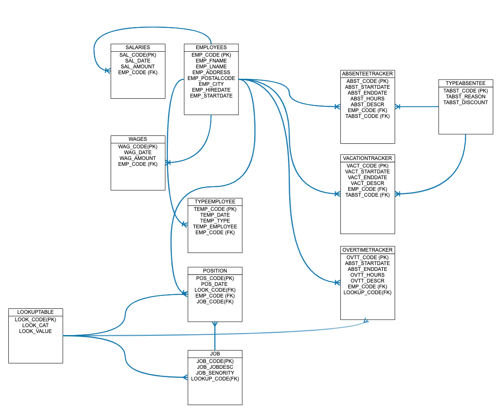

# In-class Activity: Office Machine

Professor: Khattar Daou
Student: Lucas Napoli / Phillip Spencer-Boucher
Development: Office Machine INC

# Purpose of the data base
## Tracking absences and overtime

Database should be designed thinking in the data flow process taking in to consideration the main data entries processes: **Absentee Form** and **Over Time Form**. For that reason, some work flows has been taking into consideration:
1. Department **Creation**
2. Employees **Creation**
3. Salary **Update** based on dates / change in the time
4. Type of employees **Creation**
5. Conditions **Creation**
6. Reasons for absence **creation**
7. Absentee Form **Creation**
8. Overtime Form **Creation**

# Assumptions: Users Stories 

Some assumptions are important to design the database:
1. Credentials management tables are not required
2. Logical deletion will not be implemented
3. Some parameter will be pickList
4. Control fields are not required
5. All pickLists will be listed in one table
6. Some pickLists business rules will be implemented in other layer 
7. We are not going to work with states (in-progress, completed, etc)

## PickLists

1. Ratio
2. Departments
3. Positions
4. Type of employee

### Other considerations
1. Vacations calculation will be performed in the application layer
2. Ratios and absentees calculations will be performed in the  application layer

### ER Diagram

License
----

MIT
**Free Software**